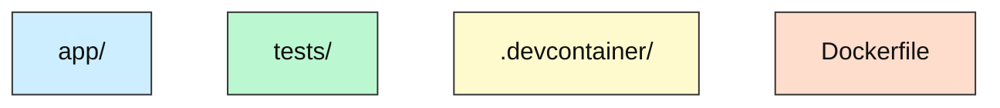
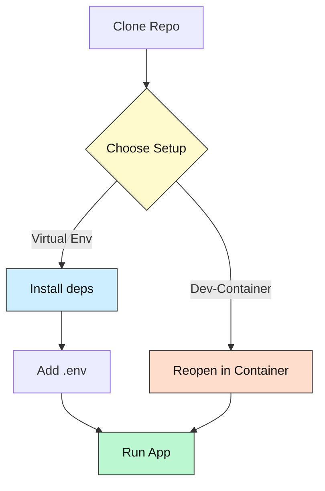
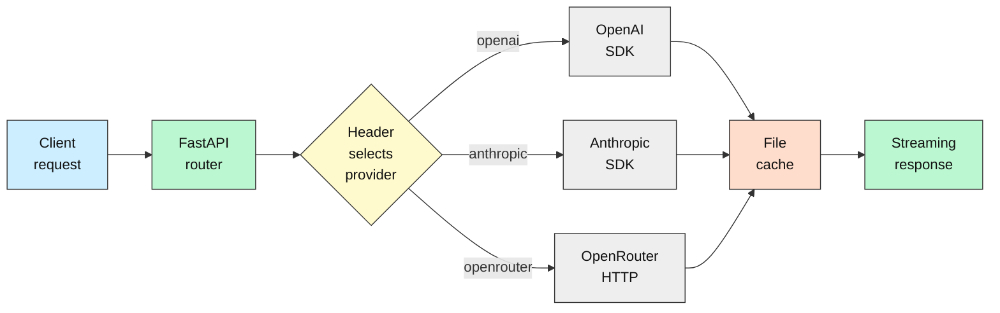
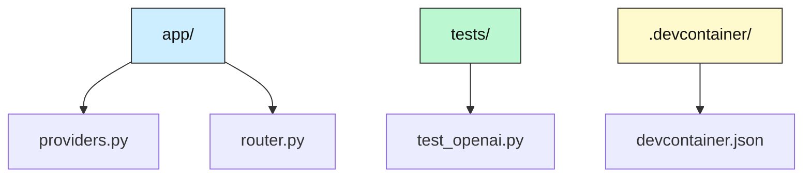
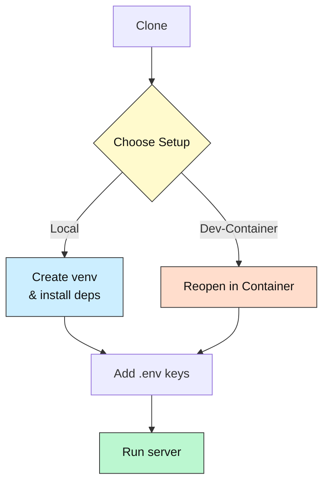

#### below is an improved format for guidelines. Written by o3 and lesser models have difficulty following the instructions

  

# Expert Instructions for the LLM  

## Produce a Beginner‑Friendly, Insightful, and Actionable `README.md`

  

────────────────────────────────────────

1  Guiding Principles

────────────────────────────────────────

• Audience = “clueless coders” (prompt engineers, first‑time devs, casual contributors).  

• Combine WHY (motivation) + HOW (exact steps).  

• Surface prerequisites early; minimise surprises.  

• Provide **two zero‑friction setup paths**: Local (Venv) and Dev‑Container.  

• Use badges, tables, diagrams, and folder trees for fast scanning.  

• Strictly follow the *high‑contrast diagram palette* (see §6).  

• Every command must be copy‑paste‑ready.

  

────────────────────────────────────────

2  Required Sections (ordered)

────────────────────────────────────────

1. Title & Badges  
2. Project Purpose (“What & Why”)  
3. Tech‑Stack Overview  
4. Fork / Improvement Note (if relevant)  
5. Key Features  
6. System Overview Diagram (BIG picture of runtime flow)  
7. Folder / File Guide (ASCII tree + Repo‑Map Diagram)  
8. Prerequisites & Accounts  
9. Setup Options  
    A. Local Virtual Env (recommended for first‑timers)  
    B. VS Code Dev‑Container (no local installs, Codespace badge)  
10. Setup Flowchart Diagram (visual install checklist)  
11. Running / Quick Commands  
12. Configuration & API Keys (+ security note)  
13. Troubleshooting / FAQ  
14. Status & Roadmap  
15. How AI Helped (optional)  
16. License & Attribution  
17. Community Support / Feedback  

  

────────────────────────────────────────

3  Folder / File Guide (Section 7 spec)

────────────────────────────────────────

Insert an indented ASCII tree (use `tree -L 3` style) **and** a Mermaid “Repo Map” that flags

where config files, scripts, and main entry‑points live. Example instruction to the LLM:

  

```text


📂 repo-root
 ├─ app/              # FastAPI endpoints
 ├─ scripts/          # Utility scripts
 ├─ tests/            # PyTest suites
 ├─ .devcontainer/    # Dev‑container spec
 ├─ Dockerfile        # (used by Dev‑container build)
 ├─ requirements.txt  # Python deps
 └─ README.md

```


  

Follow it with the **Repo Map** diagram:

  



  

− colours must follow palette in §6.

  

────────────────────────────────────────

4  Setup Options (Section 9 spec)

────────────────────────────────────────

Option A – Local Virtual Environment  

```

git clone …

cd …

python -m venv .venv

source .venv/bin/activate   # PowerShell: .\.venv\Scripts\Activate.ps1

pip install -r requirements.txt

cp .env.example .env   # add API keys

python run.py

```

  

Option B – Dev‑Container (zero host pollution)  

Prereqs: Docker Engine or Podman, VS Code + “Dev Containers” extension.  

  

1. Open folder in VS Code  

2. Command Palette → “Dev Containers: Reopen in Container”  

3. Auto‑builds `.devcontainer/` image, installs deps  

4. Launch app: `just start` **or** `npm run dev`

  

Provide a **“Open in Codespace”** badge for one‑click cloud launch.

  

────────────────────────────────────────

5  Setup Flowchart Diagram (Section 10 spec)

────────────────────────────────────────

Describe the flow (clone → choose path → success) using Mermaid and the same palette, e.g.:

  



  

────────────────────────────────────────

6  High‑Contrast Diagram Palette (single source of truth)

────────────────────────────────────────

Allowed fills only:  

`#bbf7d0` light‑green    `#ffddcc` light‑orange  

`#cceeff` light‑blue     `#fffacd` light‑yellow  

`#eeeeee` light‑grey  

Text colour: `#111111`; Borders/arrows: `#333333`.  

All diagrams in Sections 6, 7, and 10 **must** use these colours.

  

────────────────────────────────────────

7  Troubleshooting / FAQ (Section 13 spec)

────────────────────────────────────────

Include a 3‑row table of the most common beginner blockers:

  

| Symptom                 | Cause              | Fix                                   |
| ----------------------- | ------------------ | ------------------------------------- |
| `ModuleNotFoundError`   | venv not activated | `source .venv/bin/activate`           |
| VS Code “cannot attach” | Docker daemon off  | Start Docker Desktop / Podman         |
| 401 from OpenRouter     | Missing API key    | Add key to `.env` or Codespace secret |

  

────────────────────────────────────────

8  Security Note (appears in Section 12)

────────────────────────────────────────

> ⚠️ Do **not** commit `.env` files. Use repository secrets for Codespaces or CI.

  

────────────────────────────────────────

9  Cheat‑Sheet for the LLM

────────────────────────────────────────

• Every section header must be H2 (`##`).  

• Commands go in triple‑back‑tick blocks.  

• Two diagrams required: System Overview, Setup Flowchart, plus optional Repo Map.  

• Folder tree limited to depth 2 or 3.  

• No colours outside the palette.  

• Add copy‑paste `pytest -q` (or equivalent) if tests exist.  

• Badge URLs: shields.io.  

• Max 15 words per bullet for readability.

  

────────────────────────────────────────

End of template

────────────────────────────────────────

  

---

---

{{example_README.md}}

  

Instruction::

> Replace all PLACEHOLDER‑TEXT ( ALL‑CAPS ) with real values for your own project.

  


# TinyLLM‑Playground &nbsp;🚀

[](https://github.com/ORG/TinyLLM-Playground/actions)

[](LICENSE)


[](https://github.com/codespaces/new?repo=ORG%2FTinyLLM-Playground&machine=basicLinux32gb)

  

---

  

## 1· What & Why

  

TinyLLM‑Playground is a **one‑file FastAPI proxy** that lets you hit **OpenAI, Anthropic, or OpenRouter** through a single `/chat/completions` endpoint.  

Perfect when you just want to tinker with prompts, measure latency, or swap providers without rewriting code.

  

---

  

## 2· Tech‑Stack Overview

  

| Layer               | Tech                                         |
| ------------------- | -------------------------------------------- |
| **Language**        | Python 3.11, Typing                          |
| **Framework**       | FastAPI, Uvicorn                             |
| **Container**       | Dev‑Container (`.devcontainer/`)             |
| **Tests**           | PyTest                                       |
| **CI**              | GitHub Actions                               |
  

Minimum versions: **Python 3.11**, **Docker/Podman ≥ 4.0** (if using Dev‑Container).

  

---

  

## 3· Key Features

  

• Unified `/chat/completions` endpoint  

• Hot‑switch provider via HTTP header  

• Simple caching layer (file‑based)  

• Works offline with stub provider for demos  

• 100 % typed code, <300 LOC

  

---

  

## 4 · System Overview (How it works)

  



  

---

  

## 5 · Folder / File Guide

  

```text

📂 tinyllm-playground

 ├─ app/                  # FastAPI router & provider adapters
 ├─ tests/                # PyTest suites
 ├─ .devcontainer/        # Dev‑container spec
 ├─ Dockerfile            # Image used by dev‑container build
 ├─ requirements.txt      # Python deps
 ├─ README.md
 └─ .gitignore

```

  



  

---

  

## 6 · Prerequisites & Accounts

  

| Need this                               | Why             | Link                                                                                   |
| --------------------------------------- | --------------- | -------------------------------------------------------------------------------------- |
| Python 3.11+                            | core runtime    | https://python.org                                                                     |
| VS Code + Dev‑Containers ext.           | 1‑click sandbox | https://marketplace.visualstudio.com/items?itemName=ms-vscode-remote.remote-containers |
| OpenAI / Anthropic / OpenRouter API key | call real LLMs  | provider dashboards                                                                    |

  

---

  

## 7 · Setup Options (≈ 5 min)

  

### A. Local Virtual Env

  

```bash

git clone https://github.com/ORG/TinyLLM-Playground.git

cd TinyLLM-Playground

python -m venv .TinyLLM-Playground

source .TinyLLM-Playground/bin/activate          # PowerShell: .\.venv\Scripts\Activate.ps1

pip install -r requirements.txt

cp .env.example .env               # add your API keys

python -m app.router               # starts on :8000

```

  

### B. Dev‑Container (recommended)

  

1. Install Docker *or* Podman.  

2. Open the folder in VS Code → **“Reopen in Container”**.  

3. Wait for the first build (≈ 40 s).  

4. Hit F5 to launch; visit `http://localhost:8000/docs`.  

  

Or press the **“Open in Codespace”** badge to do all of the above in the cloud.

  

---

  

## 8 · Setup Flowchart

  



  

---

  

## 9 · Run / Test

  

```bash

# Start server (already active inside Dev‑Container)

uvicorn app.router:app --reload

  

# Quick smoke test

curl localhost:8000/healthz

  

# Run all unit tests

pytest -q

```

  

---

  

## 10 · Configuration & API Keys 🔑

  

1. Copy `.env.example` → `.env`.  

2. Fill any of these (leave blank to disable provider):  

```

   OPENAI_API_KEY="sk‑..."

   ANTHROPIC_API_KEY="sk‑..."

   OPENROUTER_API_KEY="or‑..."
   ```
 

3. **Do not** commit `.env`; it’s in `.gitignore`.  

4. Using Codespaces? Add the same keys under **Repository → Settings → Secrets**.

  

---

  

## 11 · Troubleshooting / FAQ

  

| Symptom                          | Cause               | Fix                                             |
| -------------------------------- | ------------------- | ----------------------------------------------- |
| `ModuleNotFoundError` on FastAPI | venv not active     | `source .venv/bin/activate`                     |
| VS Code “cannot attach”          | Docker daemon off   | Start Docker Desktop / Podman                   |
| 401 from provider                | Wrong key or header | Regenerate key; check `"X-LLM-Provider"` header |

  

---

  

## 12 · Status & Roadmap

  

✅ Basic proxy & provider switch  

✅ File‑cache  

⏳ JWT auth middleware  

🔜 Redis cache adapter  

⚠️ Known: No streaming support for Anthropic yet

  

---

  

## 13 · How AI Helped

  

ChatGPT drafted initial provider adapters; GitHub Copilot filled 30 % of unit‑test boilerplate.

  

---

  

## 14 · License

  

MIT – see [LICENSE](LICENSE).

  

---

  

## 15 · Community

  

• Open an issue for questions/ideas  

• PRs welcome – even docs or tests!  

• New to coding? Tag your issue with **`beginner‑help`** and we’ll mentor you.

  

---

  

*Happy hacking – may your tokens be ever cheaper!* 🎉

```