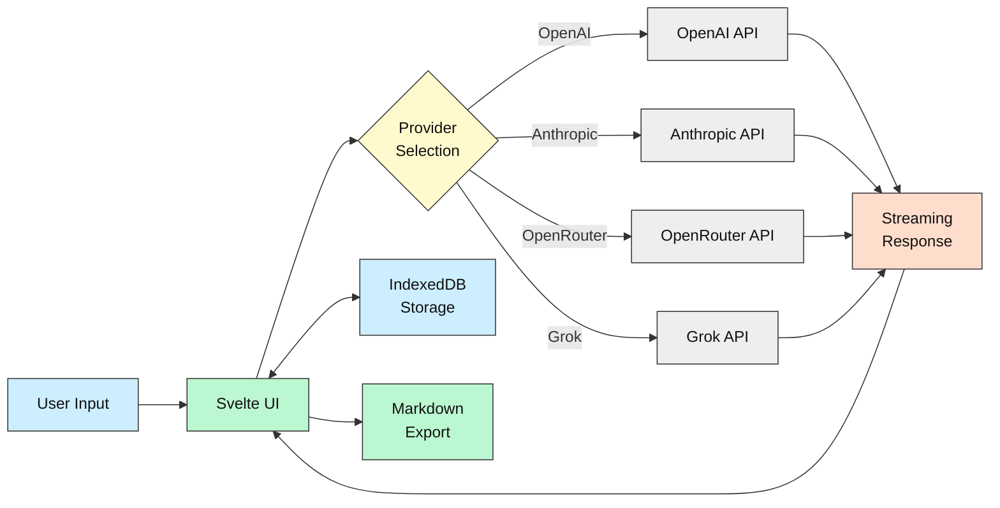
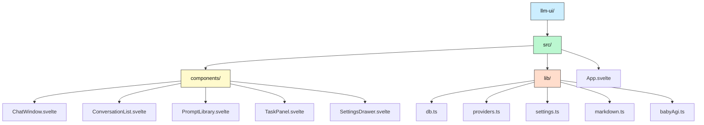
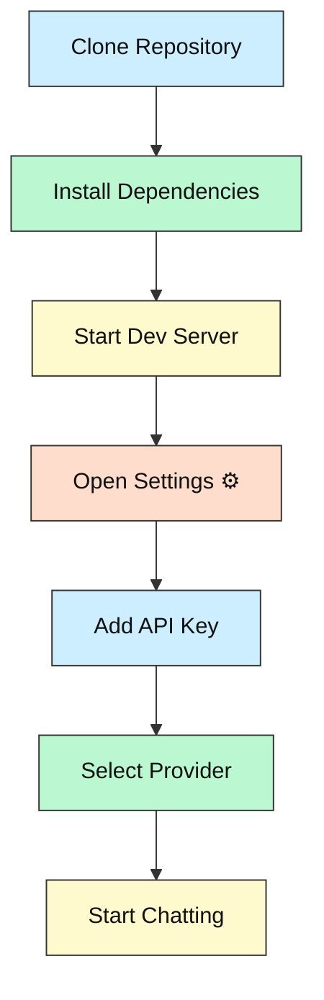

# UI42 &nbsp;🚀

[](LICENSE)


---

## 1· What & Why

UI42 is a **single-user, branchable LLM chat interface** built with Svelte and TypeScript. It addresses key knowledge management needs that most web UIs lack: conversation branching, clean Markdown export, prompt re-use, and lightweight agent tasks.

Perfect for knowledge workers who store notes in Obsidian/Foam, indie developers who want an easily deployable LLM front-end, and power users who prefer owning their data locally.

---

## 2· Tech-Stack Overview

| Layer               | Tech                                         |
| ------------------- | -------------------------------------------- |
| **Frontend**        | Svelte 5.x, TypeScript 5.7+                  |
| **Build Tool**      | Vite 6.3+                                    |
| **Storage**         | IndexedDB (Dexie.js), localStorage           |
| **LLM Integration** | OpenAI, Anthropic, OpenRouter, Grok APIs     |
| **Styling**         | CSS3 with component-scoped styles            |
| **Development**     | ESLint, Prettier, Husky                      |

Minimum versions: **Node.js 18+**, **npm 8+** or **pnpm**

---

## 3· Key Features

• Single-click Markdown export of any conversation (Obsidian-ready)  
• Branch/fork any conversation or individual assistant reply  
• Built-in prompt library with quick-insert functionality  
• Task Queue panel for running baby-agi-lite loops in-browser  
• Multi-provider support (OpenAI, Anthropic, OpenRouter, Grok)  
• 100% front-end application - runs from static hosting or file:///  
• Zero setup beyond pasting an API key

---

## 4· System Overview (How it works)



---

## 5· Folder / File Guide

```text
📂 UI42
 ├─ llm-ui/                # Main application directory
 │  ├─ src/                # Source code
 │  │  ├─ components/      # Svelte components
 │  │  │  ├─ ChatWindow.svelte       # Main chat interface
 │  │  │  ├─ ConversationList.svelte # Conversation management
 │  │  │  ├─ ExportButton.svelte     # Markdown export
 │  │  │  ├─ PromptLibrary.svelte    # Prompt templates
 │  │  │  ├─ SettingsDrawer.svelte   # API keys & preferences
 │  │  │  └─ TaskPanel.svelte        # Baby-AGI task queue
 │  │  ├─ lib/             # Utility functions and APIs
 │  │  │  ├─ db.ts                   # IndexedDB schema & helpers
 │  │  │  ├─ providers.ts            # LLM API abstraction layer
 │  │  │  ├─ settings.ts             # Settings store
 │  │  │  ├─ markdown.ts             # Export formatting
 │  │  │  └─ babyAgi.ts              # Task automation
 │  │  ├─ App.svelte       # Main application component
 │  │  └─ main.ts          # Application entry point
 │  ├─ public/             # Public assets
 │  ├─ package.json        # Dependencies and scripts
 │  └─ vite.config.ts      # Vite configuration
 ├─ .gitignore             # Git ignore rules
 └─ README.md              # Project documentation
```



---

## 6· Prerequisites & Accounts

| Need this                               | Why                      | Link                                                |
| --------------------------------------- | ------------------------ | --------------------------------------------------- |
| Node.js 18+                             | JavaScript runtime       | https://nodejs.org                                  |
| npm 8+ or pnpm                          | Package management       | https://www.npmjs.com or https://pnpm.io            |
| LLM API keys                            | Access to AI models      | See below                                           |
| Modern web browser                      | Running the application  | Chrome, Firefox, Safari, Edge                       |

**API Key Sources:**
- OpenAI: https://platform.openai.com/api-keys
- Anthropic: https://console.anthropic.com/
- OpenRouter: https://openrouter.ai/
- Grok (xAI): https://groq.com/

---

## 7· Setup Options (≈ 5 min)

### A. Local Development

```bash
# Clone the repository
git clone https://github.com/your-username/UI42.git
cd UI42/llm-ui

# Install dependencies
npm install
# or with pnpm
pnpm install

# Start development server
npm run dev
# or with pnpm
pnpm dev
```

### B. Production Build

```bash
# Build for production
npm run build
# or with pnpm
pnpm build

# Preview production build
npm run preview
# or with pnpm
pnpm preview
```

---

## 8· Setup Flowchart



---

## 9· Run / Test

```bash
# Start development server
npm run dev

# Build for production
npm run build

# Check TypeScript types
npm run check

# Format code with Prettier
npm run format

# Lint code with ESLint
npm run lint
```

---

## 10· Configuration & API Keys 🔑

1. Click the ⚙️ icon to open the Settings drawer
2. Add your API keys in the Keys tab:
   - OpenRouter API key
   - OpenAI API key
   - Anthropic API key
   - Grok API key
3. Select your default provider and model in the Models tab
4. Adjust temperature and other settings as needed

> ⚠️ API keys are stored in browser localStorage. Do **not** share your browser profile or export settings with others.

---

## 11· Troubleshooting / FAQ

| Symptom                        | Cause                    | Fix                                         |
| ------------------------------ | ------------------------ | ------------------------------------------- |
| "Add an API key" message       | Missing API key          | Add key in Settings drawer                  |
| API calls failing              | Invalid API key          | Regenerate key from provider dashboard      |
| Can't send messages            | Provider not selected    | Choose provider in Settings > Models tab    |
| Conversation not saving        | IndexedDB issues         | Try a different browser or clear cache      |

---

## 12· Status & Roadmap

✅ Core chat interface with streaming responses  
✅ Conversation persistence with IndexedDB  
✅ Branching functionality  
✅ Markdown export  
✅ Prompt library  
✅ Multi-provider support (OpenAI, Anthropic, OpenRouter, Grok)  
✅ Task automation with baby-agi-lite  
🔜 Mobile-first polishing  
🔜 Cloud database integration (optional)  
🔜 Team sync features

---

## 13· License

MIT – See [LICENSE](LICENSE) file for details.

---

## 14· Community

• Open an issue for questions or ideas  
• PRs welcome – especially for new provider integrations  
• Knowledge workers: Share your Obsidian workflows with exported chats

---

*Perfect for knowledge workers who need a better LLM chat experience!* 🚀
