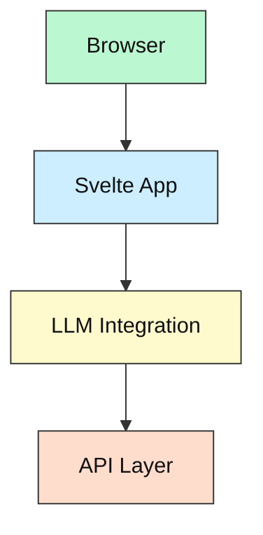
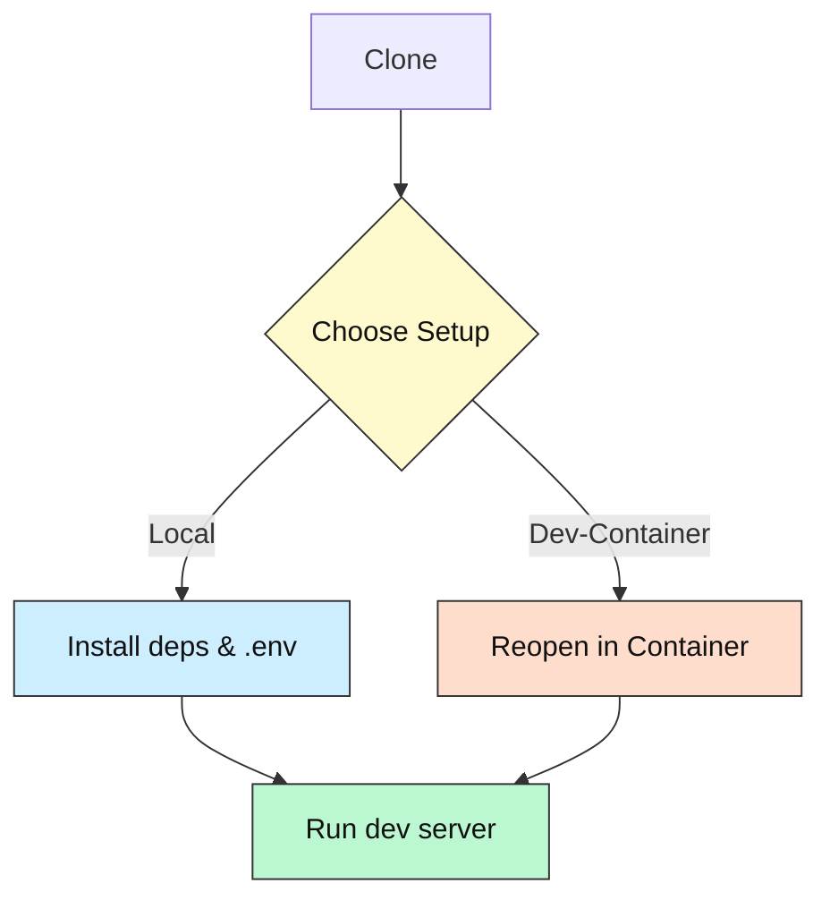

# LLM UI

[](https://github.com/your-username/llm-ui/blob/master/LICENSE)
[](https://llm-ui.vercel.app)
[](https://github.com/codespaces/new?repo=your-username%2Fllm-ui)

## Project Purpose

A modern Svelte + TypeScript + Vite web UI for interacting with LLMs. Designed for developers and AI enthusiasts to quickly prototype, test, and deploy LLM-powered applications with a beautiful, fast, and extensible interface.

## Tech Stack Overview

| Tech         | Purpose            | Link                                               |
| ------------|------------------- |----------------------------------------------------|
| Svelte 4.x  | UI Framework       | https://svelte.dev                                 |
| TypeScript  | Language           | https://www.typescriptlang.org                     |
| Vite        | Build Tool         | https://vitejs.dev                                 |
| Dexie       | IndexedDB Wrapper  | https://dexie.org                                  |
| VS Code     | IDE                | https://code.visualstudio.com                      |
| Vercel      | Deployment         | https://vercel.com                                 |

## Key Features

- Modern, reactive UI with Svelte 4
- TypeScript for safety and maintainability
- Hot Module Replacement (HMR) for fast dev cycles
- IndexedDB-based local storage (Dexie)
- Easy deployment to Vercel
- Ready for LLM API integration

## System Overview Diagram



## Folder / File Guide

```
llm-ui
├─ src/
│  ├─ components/    # Reusable UI components
│  ├─ lib/           # Utility functions & LLM API wrappers
│  ├─ routes/        # Page components
│  └─ App.svelte     # Main application component
├─ public/           # Static assets
├─ .gitignore
├─ package.json      # Project metadata & scripts
├─ tsconfig.json     # TypeScript config
├─ README.md         # This file
```

## Prerequisites & Accounts

- Node.js 18+ (LTS recommended)
- npm 8+ or yarn
- (Optional) LLM API keys (OpenAI, Anthropic, OpenRouter, etc.)
- VS Code (recommended)

## Setup Options

### A. Local Development

```bash
# Clone the repository
git clone https://github.com/your-username/llm-ui.git
cd llm-ui

# Install dependencies
npm install

# Copy env example and set API keys
cp .env.example .env
# (edit .env to add your keys)

# Start development server
npm run dev
```

### B. Dev Container (VS Code)

1. Install Docker Desktop
2. Open the folder in VS Code
3. Press F1 → "Dev Containers: Reopen in Container"
4. The container will build and start automatically

Or use the “Open in Codespace” badge for a one-click cloud dev environment.

## Setup Flowchart Diagram



## Running / Quick Commands

```bash
# Development mode
npm run dev

# Build for production
npm run build

# Preview production build
npm run preview
```

## Configuration & API Keys 🔑

- Copy `.env.example` → `.env` and fill in your LLM API keys as needed.
- Example keys:
  - OPENAI_API_KEY
  - ANTHROPIC_API_KEY
  - OPENROUTER_API_KEY
- **Do not commit `.env`**; it is gitignored.

## Troubleshooting / FAQ

| Symptom                   | Cause                   | Fix                                        |
|---------------------------|-------------------------|---------------------------------------------|
| HMR not working           | Outdated deps           | Upgrade Node.js, Vite, Svelte               |
| TypeScript errors         | TS config or deps       | Check `tsconfig.json`, reinstall node mods  |
| Build errors              | Corrupt deps            | Delete `node_modules`, reinstall            |
| API errors                | Missing/invalid API key | Check `.env` and API provider dashboard     |

## Status & Roadmap

- [x] Svelte + TypeScript + Vite setup
- [x] Basic UI component structure
- [ ] LLM API integration
- [ ] Advanced prompt features
- [ ] Documentation completion

## How AI Helped

- Copilot and GPT-4 assisted with component scaffolding and API integration patterns.

## License & Attribution

MIT License – see [LICENSE](LICENSE).

## Community Support / Feedback

- Open an issue on GitHub
- PRs welcome (docs, tests, features)
- New to coding? Tag your issue with **`beginner-help`** and we’ll mentor you.

---

*Happy hacking – may your tokens be ever cheaper!* 🎉
