# LLM UI 🚀

[](LICENSE)
[](https://svelte.dev/)
[](https://www.typescriptlang.org/)
[](https://vitejs.dev/)
[](https://github.com/codespaces/new?repo=your-username%2Fllm-ui)

## Project Purpose

LLM UI is a modern, reactive web interface for interacting with various Large Language Model providers. Built with Svelte 5 and TypeScript, it offers a clean, fast, and extensible UI for developers and AI enthusiasts to prototype, test, and deploy LLM-powered applications. The app supports multiple providers (OpenAI, Anthropic, OpenRouter, Groq) through a unified interface with conversation management, prompt libraries, and task automation.

## Tech Stack Overview

| Tech         | Purpose                | Link                                   |
|--------------|------------------------|----------------------------------------|
| Svelte 5     | UI Framework           | https://svelte.dev                     |
| TypeScript   | Language               | https://www.typescriptlang.org         |
| Vite         | Build Tool             | https://vitejs.dev                     |
| Dexie        | IndexedDB Wrapper      | https://dexie.org                      |
| File-Saver   | Export Functionality   | https://github.com/eligrey/FileSaver.js|

## Key Features

- Multi-provider support (OpenAI, Anthropic, OpenRouter, Groq)
- Conversation management with branching
- Markdown export of conversations
- Prompt library for reusable templates
- Task automation with BabyAGI-style agent
- Local storage with IndexedDB (Dexie)
- Responsive design for desktop and mobile

## System Overview Diagram


## Folder / File Guide

```
📂 llm-ui
 ├─ src/                  # Source code
 │  ├─ components/        # Svelte UI components
 │  ├─ lib/               # Utility functions & API wrappers
 │  ├─ App.svelte         # Main application component
 │  └─ main.ts            # Application entry point
 ├─ public/               # Static assets
 ├─ .env.example          # Environment variables template
 ├─ index.html            # HTML entry point
 ├─ package.json          # Project metadata & scripts
 ├─ tsconfig.json         # TypeScript configuration
 └─ vite.config.ts        # Vite build configuration
```


## Prerequisites & Accounts

| Need this                               | Why                          | Link                                                |
|----------------------------------------|------------------------------|-----------------------------------------------------|
| Node.js 18+ (LTS recommended)          | Runtime environment          | https://nodejs.org                                  |
| npm 8+ or pnpm                         | Package manager              | https://www.npmjs.com or https://pnpm.io            |
| LLM API keys (optional)                | Connect to LLM providers     | OpenAI, Anthropic, OpenRouter, or Groq dashboards   |
| VS Code (recommended)                  | IDE with Svelte support      | https://code.visualstudio.com                       |

## Setup Options

### A. Local Development

```bash
# Clone the repository
git clone https://github.com/your-username/llm-ui.git
cd llm-ui

# Install dependencies
npm install
# or with pnpm
pnpm install

# Copy env example and set API keys (optional)
cp .env.example .env
# (edit .env to add your keys)

# Start development server
npm run dev
# or with pnpm
pnpm dev
```

### B. Dev Container (VS Code)

1. Install Docker Desktop
2. Open the folder in VS Code
3. Press F1 → "Dev Containers: Reopen in Container"
4. The container will build and start automatically

Or use the "Open in Codespace" badge for a one-click cloud dev environment.

## Setup Flowchart Diagram

```mermaid
flowchart TD
    A[Clone Repository] --> B{Choose Setup}
    B -->|Local| C[Install Dependencies]
    C --> D[Configure API Keys]
    D --> E[Run Dev Server]
    B -->|Dev-Container| F[Reopen in Container]
    F --> D
    style B fill:#fffacd,stroke:#333333,color:#111111
    style C fill:#cceeff,stroke:#333333,color:#111111
    style F fill:#ffddcc,stroke:#333333,color:#111111
    style E fill:#bbf7d0,stroke:#333333,color:#111111
```



## Running / Quick Commands

```bash
# Development mode
npm run dev

# Type checking
npm run check

# Build for production
npm run build

# Preview production build
npm run preview

# Linting
npm run lint

# Formatting
npm run format
```

## Configuration & API Keys 🔑

- Copy `.env.example` → `.env` and fill in your LLM API keys as needed.
- Example keys:
  - OPENAI_API_KEY
  - ANTHROPIC_API_KEY
  - OPENROUTER_API_KEY
  - GROQ_API_KEY
- Alternatively, you can add API keys directly in the app's settings interface.
- **Do not commit `.env`**; it is gitignored.

## Troubleshooting / FAQ

| Symptom                   | Cause                   | Fix                                        |
|---------------------------|-------------------------|---------------------------------------------|
| API errors                | Missing/invalid API key | Check settings panel and add valid API keys |
| HMR not working           | Outdated dependencies   | Update Node.js, Vite, Svelte               |
| TypeScript errors         | Type mismatches         | Run `npm run check` to identify issues      |
| Build errors              | Corrupt dependencies    | Delete `node_modules` and reinstall         |
| IndexedDB errors          | Browser compatibility   | Use a modern browser (Chrome, Firefox, Edge)|

## Status & Roadmap

- [x] Multi-provider support
- [x] Conversation management
- [x] Prompt library
- [x] Task automation
- [x] Markdown export
- [ ] Streaming responses for all providers
- [ ] OAuth authentication
- [ ] Cloud sync
- [ ] Mobile app wrapper

## How AI Helped

This project was developed with assistance from:
- GPT-4 for code architecture suggestions and debugging
- GitHub Copilot for code completion and documentation

## License & Attribution

MIT License – see [LICENSE](LICENSE).

## Community Support / Feedback

- Open an issue on GitHub
- PRs welcome (docs, tests, features)
- New to coding? Tag your issue with **`beginner-help`** and we'll mentor you.

---

*Happy hacking – may your tokens be ever cheaper!* 🎉
