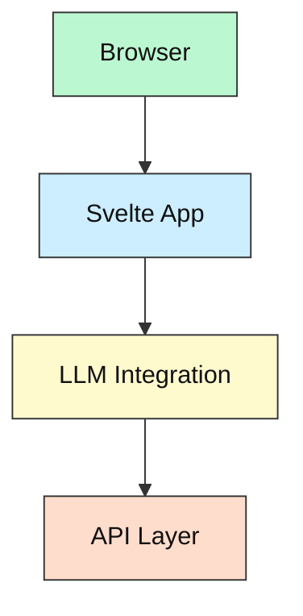

# LLM UI - Modern Svelte + TypeScript + Vite Application

[](https://github.com/your-username/llm-ui/blob/master/LICENSE)
[](https://llm-ui.vercel.app)
[](https://github.com/codespaces/new?repo=your-username%2Fllm-ui)

## Project Purpose

A modern web application built with Svelte, TypeScript, and Vite, designed to provide a seamless user experience for interacting with LLM models. Perfect for developers looking to build AI-powered applications with a focus on performance and developer experience.

## Tech Stack

- **Frontend**: Svelte 4.x
- **Language**: TypeScript
- **Build Tool**: Vite
- **IDE Support**: VS Code
- **Deployment**: Vercel

## Key Features

- Modern UI components with Svelte
- TypeScript for type safety
- Hot Module Replacement (HMR)
- Production-ready build configuration
- Easy deployment options

## System Overview



## Project Structure

```
llm-ui
├─ src/
│  ├─ components/    # Reusable UI components
│  ├─ lib/           # Utility functions
│  ├─ routes/        # Page components
│  └─ App.svelte     # Main application component
├─ public/
├─ .gitignore
├─ package.json
├─ tsconfig.json
└─ README.md
```

## Prerequisites

- Node.js 18+ (LTS recommended)
- npm 8+ or yarn
- VS Code (recommended)

## Setup Options

### Option A: Local Development

```bash
# Clone the repository
git clone https://github.com/your-username/llm-ui.git
cd llm-ui

# Install dependencies
npm install

# Start development server
npm run dev
```

### Option B: Dev Container

1. Install Docker Desktop
2. Open in VS Code
3. Press F1 and select "Dev Containers: Reopen in Container"
4. The container will build and start automatically

## Running the Application

```bash
# Development mode
npm run dev

# Build for production
npm run build

# Preview production build
npm run preview
```

## Configuration

The project uses environment variables for configuration. Create a `.env` file in the root directory:

```bash
cp .env.example .env
```

## Troubleshooting

- **HMR Issues**: Ensure you're using the latest version of Node.js and Vite
- **TypeScript Errors**: Check your `tsconfig.json` and ensure all dependencies are installed
- **Build Errors**: Clear your `node_modules` and reinstall dependencies

## Status & Roadmap

- [x] Initial setup with Svelte + TypeScript + Vite
- [x] Basic component structure
- [ ] LLM integration
- [ ] Advanced features
- [ ] Documentation completion

## License

This project is licensed under the MIT License - see the [LICENSE](LICENSE) file for details.

## Support

For support, please:

1. Open an issue on GitHub
2. Join our Discord community
3. Check the project documentation
